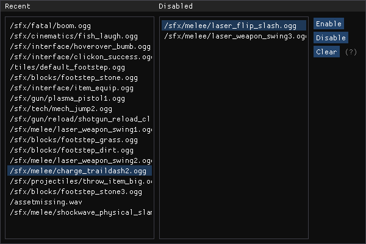

<h2>SoundMuffler</h2>

Version: 1.0.0

Disclamers: only tested on windows, built for x64, should be compatible with other dlls unless there are conflicting hooks that may get overridden

The main dll can either be injected via [StarExtensions](https://github.com/StarExtensions/StarExtensions) using the libraries.txt feature added in version 1.4.17 OR by injecting manually.

<h3>GUIDE</h3>

<h4>Installation</h4>

Place SoundMuffler.dll and libraries.txt (or create your own) into the same win64 folder as your StarExtensions.dll

<h4>Usage</h4>

If everything is working correctly, once the dll has loaded you should be able to press the 'end' key on your keyboard which will trigger the interface to show, if this doesn't work check your logs for the message "Failed to create directX9 device." 
then there will be 2 areas, on the left the "recent" area and on the right the "disabled" area, sounds displayed in the recent area are sounds that have recently been played, sounds in the disabled area are sounds that have been disabled. 
Clicking enable will make the currently selected disabled sound become enabled again. 
Clicking disable will make the currently selected recent sound become disabled. 
Clicking clear will clear the recent sounds area. 
Press end again to hide the interface.

<h3>TROUBLESHOOTING</h3>

If the mod is not working, this could be for multiple reasons however there is information logged by the dll to help diagnose the problem.

Step 1: check your logs for "Loading extra library soundMuffler.dll", this isnt needed if you are injecting with a different method
if you cannot find this in your logs it means StarExtensions hasnt found the libaries.txt, make sure your libraries.txt is inside the same win64 folder as StarExtensions.dll and that inside the libraries.txt it says "soundMuffler.dll"
if the libraries.txt IS in the same folder and it still isnt working try deleting libraries.txt and creating it again remembering to write "soundMuffler.dll" inside

Step 2: check your logs for "Loaded Sound Muffler Version 1.0.0", if StarExtensions.dll found the library to load and this doesnt log this means that the dll failed to inject or there was some issue with logging, if it fails to inject then i have no idea how you can fix that, but it could also be failing at logging which would mean that the log function is at a different address to expected, this could mean that you are on an incompatable build of Starbound so if you arent on windows or x64 then this could be causing the problem

at this point the only other logged messages will be error messages so you will know what the problem is

<h4>What to do if it crashes:</h4>

